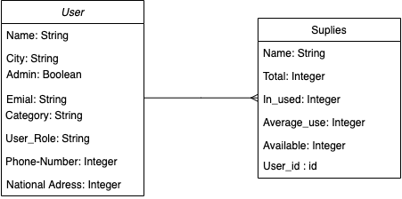
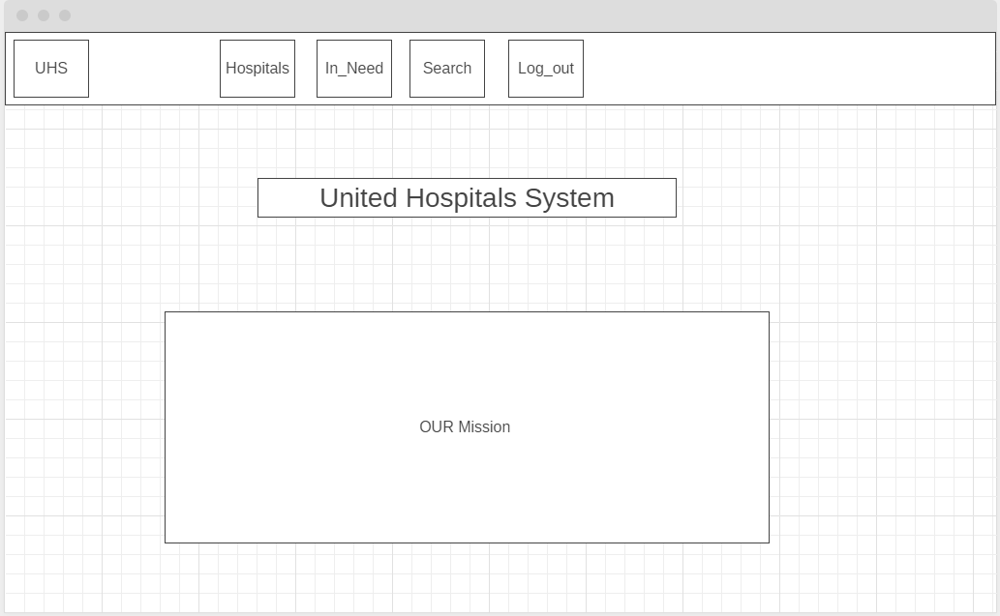
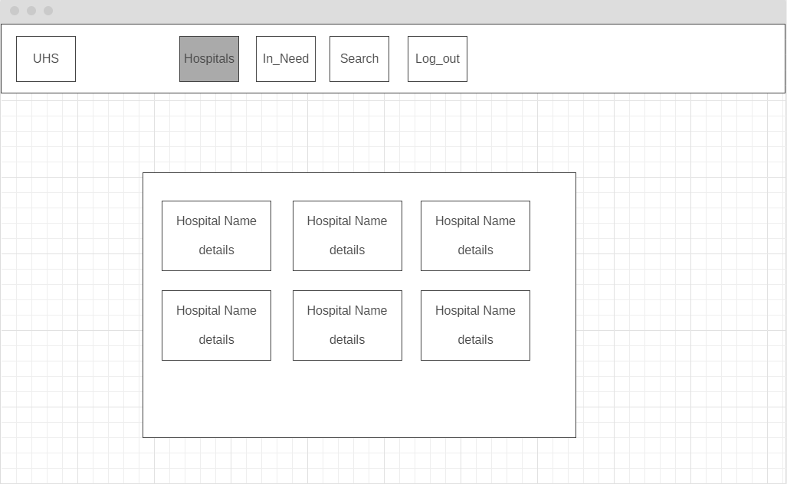
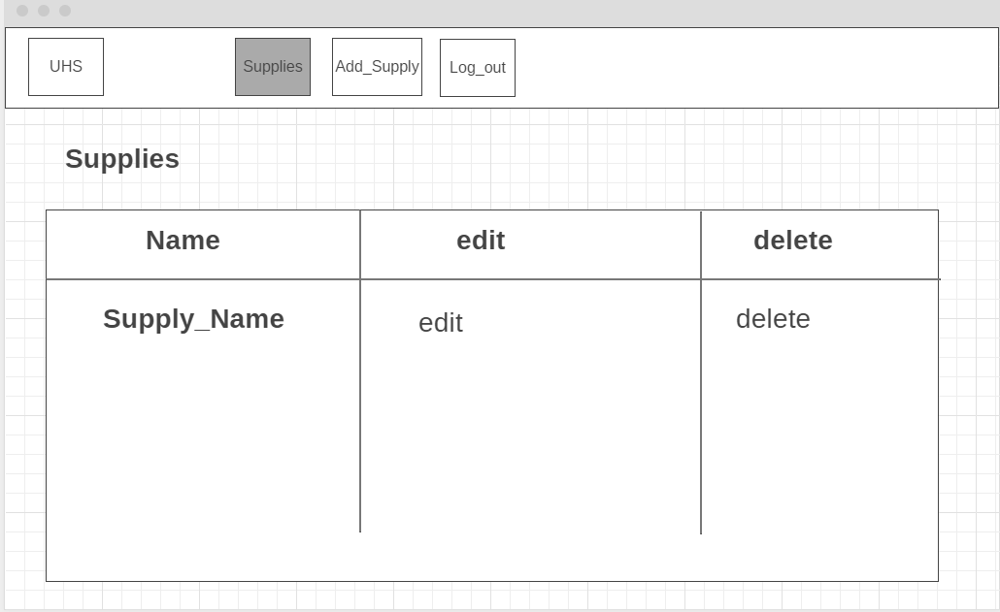
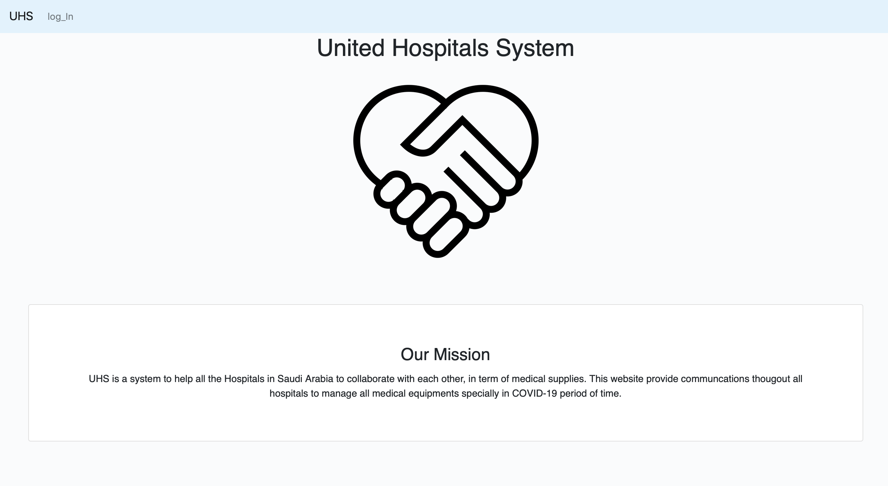
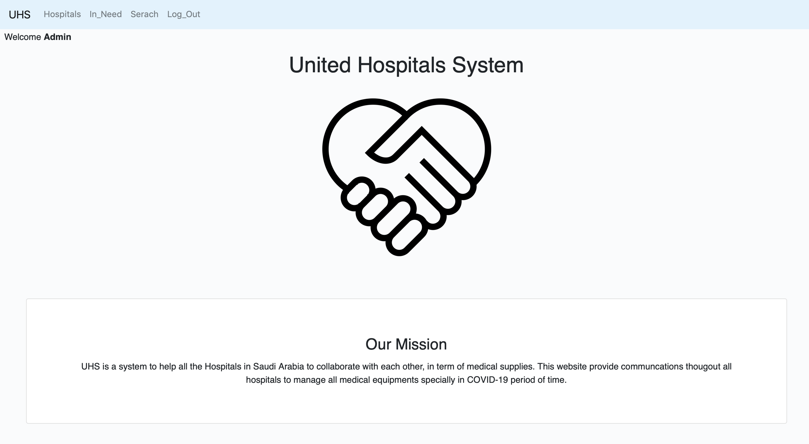
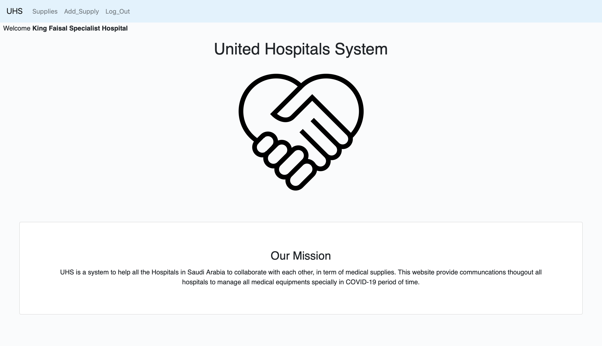

# United Hospitals System

## Overview

UHS is a system to help all the Hospitals in Saudi Arabia to collaborate with each other, in term of medical supplies. This website provide communcations thougout all hospitals to manage all medical equipments specially in COVID-19 period of time.

## List of technologies used

* Ruby 
* Ruby on rails 
* postgresql
* Heroku

## User story

* as admin can see all supplies of all hospitals
* as admin can see all hospitals .
* as admin can see all hospitals that need supplies.
* as admin can search by the suppliy name and city in all hospitals
* as admin have to inform the hospital by phone call .
* as admin have to sign-in and log-out
* as hospital can sign-in and log-ou
* as hospital can rigister in the system .
* as hospital can see all his supplies .
* as hospital can add new supply .

## ERD

## Wireframe 

## demo 

